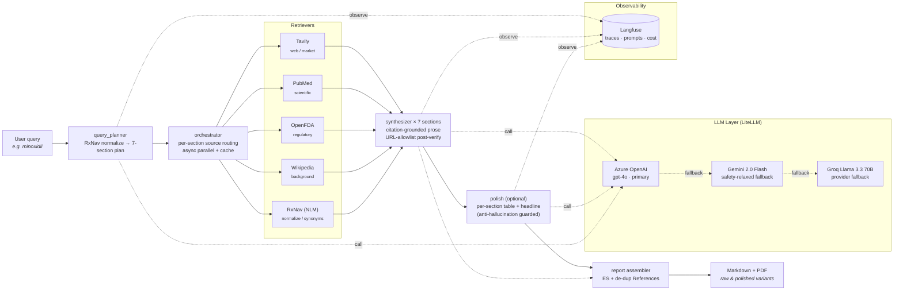

# Mentis 🔍

**Procurement intelligence reports for medical substances.** Type a substance, get a structured, citation-grounded brief covering its product profile, clinical use, market & demand, manufacturers, regulatory status, sourcing & pricing, and risks & alternatives — with every claim backed by a verified source URL.

Built as a portfolio-grade demonstration of production-shape AI engineering: hybrid retrieval, citation-grounded synthesis, four-step safety escalation, versioned prompts, per-call cost accounting, and observable traces.

→ **Live demo:** [`huggingface.co/spaces/AnsumanBhujabal/Mentis`](https://huggingface.co/spaces/AnsumanBhujabal/Mentis)
→ **Sample outputs:** [`walkthrough/sample_reports/`](walkthrough/sample_reports)
→ **Design spec:** [`docs/superpowers/specs/2026-05-11-mentis-poc-design.md`](docs/superpowers/specs/2026-05-11-mentis-poc-design.md)

---

## What's in a Report

Each report has **seven sections**, ordered for procurement decision-making:

| # | Section | Routed to |
|---|---|---|
| 1 | Product Profile (composition, dosage forms, INN) | Wikipedia, RxNav, OpenFDA |
| 2 | Clinical Use (indications, contraindications, dosing) | PubMed, Wikipedia |
| 3 | Market & Demand (volumes, geography, trends) | Tavily |
| 4 | Manufacturers (key players, capacity, geographic footprint) | Tavily, OpenFDA |
| 5 | Regulatory Status (approvals, warnings, recalls) | OpenFDA, Tavily |
| 6 | Sourcing & Pricing (procurement signals, tenders) | Tavily |
| 7 | Risks & Alternatives (shortages, substitutes, supply concentration) | Tavily, PubMed |

Plus an **executive summary** and a fully-de-duplicated **References** section, rendered to markdown and a branded A4 PDF.

---

## Architecture



For a polished PNG rendering with vendor icons, install Graphviz (`apt install graphviz` / `brew install graphviz`) and run `make diagram` — the source is [`docs/architecture.py`](docs/architecture.py) using [mingrammer/diagrams](https://github.com/mingrammer/diagrams).

### Key architectural decisions

- **Hybrid retrieval, not RAG-over-corpus.** A vector DB over 100 PDFs wouldn't cover the breadth of regulatory + market data and would go stale weekly. Instead, each section is routed to authority-appropriate live APIs and merged.
- **Citation grounding as a feature, not a guardrail.** The synthesizer is told the URL allow-list; after generation, the system regex-extracts every cited URL and rejects the response if any URL is hallucinated. One retry, then graceful fall-through to a raw-snippet render with a visible footer.
- **Provider abstraction via LiteLLM, with a four-step safety chain.** If the primary provider's safety filter blocks a legitimate medical query, the chain escalates: relax → reframe → swap provider → raw snippets. Verified working on queries that have benign procurement intent but trigger naive filters (e.g., controlled substances, vaccine compositions).
- **Prompts versioned in Langfuse, with file fallback.** No prompts in code. `scripts/sync_prompts.py` pushes `prompts/*.j2` to Langfuse on release; runtime fetches with stale-while-revalidate semantics.
- **Per-call cost accounted at the pipeline level.** A module-level threading-locked accumulator (originally a `ContextVar`, but `asyncio.gather` copies contexts so mutations don't propagate back — see [the lesson](docs/lessons/cost-accumulator.md) if added).
- **Polish layer is optional + per-section.** A separate post-processing stage adds a structured headline and a comparison table per section. Each polish call is narrowly scoped so the underlying prose is preserved verbatim — whole-report polish over-compressed.

---

## Observability in Production

Live Langfuse project: [`Ultradoc-ansuman / Mentis`](https://us.cloud.langfuse.com)

| Metric | Value (rolling 3h, gpt-4o primary) |
|---|---|
| Traces | 20 |
| Observations | 40 (≈ 2 per trace: plan + synthesis) |
| Total spend | **$0.160836 USD** |
| Tokens (gpt-4o) | 32.23 K |
| Cost / report | ≈ $0.06 – $0.10 |
| End-to-end latency | 30 – 50 s (cold) · < 200 ms (cached samples) |

Each report's PDF carries the actual measured cost in its metadata footer — not an estimate, not a hardcoded value. The number comes from `litellm.completion_cost` summed across every LLM call in the pipeline.

---

## Quickstart

```bash
git clone https://github.com/Ansumanbhujabal/Mentis
cd Mentis
uv sync
cp .env.example .env   # fill in keys; see below

# CLI — single report, raw output
uv run mentis report "minoxidil" --out report.md --pdf report.pdf

# CLI — with the polish post-processing layer (extra LLM call per section)
uv run mentis report "minoxidil" --polish --out report.md --pdf report.pdf

# Gradio app (local)
uv run python app.py
```

The Gradio app has three pre-cached sample chips (saline, tramadol, insulin glargine, minoxidil) that return instantly without spending any LLM tokens — useful for demos.

## Required Keys

| Variable | Where to get | Required? |
|---|---|---|
| `AZURE_OPENAI_API_KEY`, `AZURE_OPENAI_API_BASE`, `AZURE_OPENAI_API_VERSION`, `AZURE_OPENAI_MODEL` | Your Azure OpenAI deployment | Recommended (production primary) |
| `GEMINI_API_KEY` | [aistudio.google.com](https://aistudio.google.com/app/apikey) | Optional, used as fallback |
| `GROQ_API_KEY` | [console.groq.com](https://console.groq.com) | Optional, used as fallback |
| `TAVILY_API_KEY` | [app.tavily.com](https://app.tavily.com/sign-in) (1000 free searches/month) | Required for market/sourcing |
| `LANGFUSE_PUBLIC_KEY`, `LANGFUSE_SECRET_KEY`, `LANGFUSE_HOST` | [cloud.langfuse.com](https://cloud.langfuse.com) | Optional; pipeline runs without it (no traces, no versioned prompts) |
| `MENTIS_PRIMARY_MODEL`, `MENTIS_PROVIDERS` | env override of provider order | Optional |

PubMed, OpenFDA, Wikipedia, and RxNav need no keys.

---

## Project Layout

```
mentis/
├── mentis/                # library
│   ├── schemas.py         # Pydantic models for every stage I/O
│   ├── cache.py           # file-based snippet cache
│   ├── llm.py             # LiteLLM client + safety chain + cost accumulator
│   ├── prompts.py         # Langfuse + local file prompt registry
│   ├── retrievers/        # tavily, pubmed, openfda, wikipedia, rxnav
│   ├── query_planner.py   # query → 7-section plan
│   ├── orchestrator.py    # per-section source routing + parallel fetch
│   ├── synthesizer.py     # snippets → citation-grounded prose
│   ├── polish.py          # optional post-processing layer
│   ├── report.py          # assemble ES + dedupe references
│   ├── pdf.py             # WeasyPrint markdown → A4 PDF
│   ├── cli.py             # Click CLI
│   └── observability.py   # Langfuse init + LiteLLM callback wiring
├── prompts/               # versioned Jinja2 templates (source of truth)
├── app.py                 # Gradio entry (HF Spaces)
├── scripts/sync_prompts.py
├── walkthrough/sample_reports/  # cached demos (4 substances, raw + polished)
├── docs/architecture.py   # mingrammer diagram source
└── tests/                 # 38 tests, pytest-asyncio
```

---

## Features

- **Hybrid retrieval orchestrator** — each section routed to authority-appropriate sources; async parallel fetch with file cache.
- **Citation grounding** — synthesizer can only cite URLs from retrieved snippets; post-generation regex verification rejects hallucinated URLs; retry-once then graceful raw-snippet fallback.
- **Four-step safety escalation** — relax → reframe → provider swap → honest raw-snippets fallback covers most legitimate medical queries.
- **Langfuse-managed prompts** — `prompts/*.j2` is source of truth; runtime fetches versioned prompts with file fallback. Zero prompts in code.
- **Per-call cost** — `litellm.completion_cost` summed across the pipeline, surfaced in every PDF.
- **Per-section polish layer** — optional post-processing adds a headline + comparison table per section while preserving the synthesizer's prose verbatim.
- **PDF export via WeasyPrint** — A4, branded, with GFM tables, alternating row stripes, source-column hyperlinks.
- **Anti-hallucination receipts** — the synthesizer's URL-allowlist guard has caught real hallucinations during testing and reverted to safe fallbacks.

---

## Roadmap

- **v2** — Domain fact-checker layer (e.g., MedGemma) over critical claims; eval harness with hand-labeled gold reports + regression gates in CI.
- **v3** — Dynamic section planning (sections proposed per substance, not hard-coded); user-uploadable internal procurement docs as additional retrieval source.

---

## License

Proprietary POC. Sample reports in `walkthrough/sample_reports/` are illustrative; do not use as a basis for clinical or procurement decisions without independent verification.
